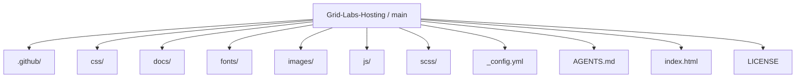
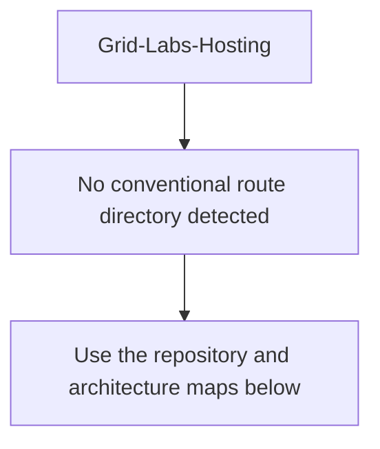
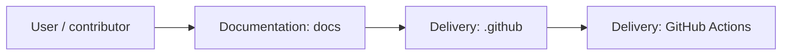
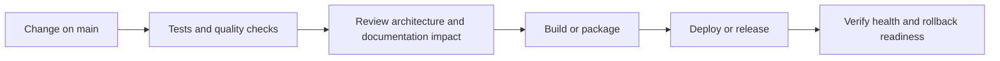
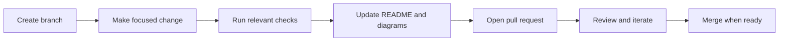

<!-- interactive-readme-standard:start -->

<div align="center">

# Grid-Labs-Hosting

**Branch-aware technical guide for [`main`](https://github.com/Nischhalsubba/Grid-Labs-Hosting/tree/main)**

<p>      </p>

<p>
  <a href="https://github.com/Nischhalsubba/Grid-Labs-Hosting/tree/main"><strong>Browse source</strong></a> ·
  <a href="https://github.com/Nischhalsubba/Grid-Labs-Hosting/issues"><strong>Issues</strong></a> ·
  <a href="https://github.com/Nischhalsubba/Grid-Labs-Hosting/codespaces/new?ref=main"><strong>Open in Codespaces</strong></a>
</p>

</div>

> [!IMPORTANT]
> This guide is generated from the files actually present on `main`. It links to detected source paths, preserves project-authored notes, and avoids claiming components that were not found.

## At a glance

| Item | Detected value |
|---|---|
| Purpose | A Sass project documented from the current branch structure and manifests. |
| Branch role | Default branch |
| Stack | Sass, CSS, JavaScript, HTML |
| Manifests | No standard manifest detected |
| Prerequisites | Confirm from the detected manifests |
| Delivery | GitHub Actions |
| License | LICENSE |

## Branch scope

This is the repository's default branch.


## Quick start

> No reliable setup command was detected. Use the preserved project-authored notes and manifests rather than guessing.

### Configuration surface

- No committed environment example file was detected.

> Never commit secrets, private keys, production credentials, customer data, or unredacted infrastructure details.

## Repository map



| Responsibility | Detected source paths |
|---|---|
| Documentation | [`docs`](https://github.com/Nischhalsubba/Grid-Labs-Hosting/tree/main/docs) |
| Delivery | [`.github`](https://github.com/Nischhalsubba/Grid-Labs-Hosting/tree/main/.github) |

## Website or application map



## Architecture and responsibility flow




## Quality, security, and operations

<table>
<tr>
<td width="33%" valign="top">

### Quality

- No conventional test directory was detected automatically.

Detected commands:
- No standard quality command detected.

</td>
<td width="33%" valign="top">

### Security

- No dedicated security policy or automated dependency configuration was detected.

Review authentication, authorization, input validation, dependency updates, secret handling, and failure recovery before release.

</td>
<td width="34%" valign="top">

### Observability

- No dedicated observability integration was detected automatically.

Define useful logs, metrics, traces, alerts, and rollback signals for production-facing branches.

</td>
</tr>
</table>

## Delivery flow



### Automation detected

- [`.github/workflows/apply-interactive-readme.yml`](https://github.com/Nischhalsubba/Grid-Labs-Hosting/blob/main/.github/workflows/apply-interactive-readme.yml)

## Contribution flow



- Keep changes focused and explain architectural consequences.
- Run the checks relevant to the changed area.
- Update diagrams whenever routes, modules, data models, authentication, jobs, or delivery paths change.
- Add screenshots or recordings for visual behavior changes when useful.
- Use issues for reproducible defects and pull requests for reviewable changes.

## Ownership and support

| Topic | Source |
|---|---|
| Repository | [`Nischhalsubba/Grid-Labs-Hosting`](https://github.com/Nischhalsubba/Grid-Labs-Hosting) |
| Branch | [`main`](https://github.com/Nischhalsubba/Grid-Labs-Hosting/tree/main) |
| Ownership | No CODEOWNERS file detected |
| Contributing | Use the contribution flow above |
| Support | [Open or review issues](https://github.com/Nischhalsubba/Grid-Labs-Hosting/issues) |
| License | [`LICENSE`](https://github.com/Nischhalsubba/Grid-Labs-Hosting/blob/main/LICENSE) |

<details>
<summary><strong>Documentation maintenance checklist</strong></summary>

- [ ] Purpose and branch scope are accurate.
- [ ] Setup and configuration commands still work.
- [ ] Repository, application, API, data, authentication, job, and deployment diagrams match the code.
- [ ] Tests, security controls, observability, and rollback behavior are documented.
- [ ] Links point to real files on this branch.
- [ ] No secrets or private operational details are exposed.

</details>

<!-- interactive-readme-standard:end -->

<!-- project-authored-notes:start -->
<details>
<summary><strong>Project-authored notes preserved from this branch</strong></summary>

<div align="center">
  
</div>

# Grid Labs Hosting

> A Bootstrap-based static landing page for a hosting / technology services company, featuring domain search, hosting service cards, feature sections, testimonials, pricing tabs, FAQ-style support content, and a contact form UI.

[](#tech-stack)
[](#tech-stack)
[](#tech-stack)
[](#deployment)

---

## Table of Contents

- [Overview](#overview)
- [Project Intent](#project-intent)
- [Designer's Perspective](#designers-perspective)
- [Page Sections](#page-sections)
- [Features](#features)
- [Tech Stack](#tech-stack)
- [Repository Structure](#repository-structure)
- [UX and Visual Direction](#ux-and-visual-direction)
- [Interaction Notes](#interaction-notes)
- [Content Notes](#content-notes)
- [Accessibility Notes](#accessibility-notes)
- [Installation](#installation)
- [Usage](#usage)
- [Deployment](#deployment)
- [Quality Checklist](#quality-checklist)
- [Suggestions for Improvement](#suggestions-for-improvement)
- [License](#license)

---

## Overview

**Grid Labs Hosting** is a static hosting-company website concept. The project is designed as a single-page marketing landing page for web hosting, domain search, pricing, customer testimonials, and contact inquiries.

The current codebase uses HTML, CSS, JavaScript, Bootstrap, and icon libraries. It is intentionally lightweight and can be opened directly in the browser or served through any static server.

The main page includes a fixed navigation bar, hero/domain search section, service overview, feature explanation blocks, testimonial carousel, pricing tabs, and a contact form interface.

---

## Project Intent

The goal of this repository is to present a clean hosting landing page that could be adapted for a hosting startup, web services company, or technology support brand.

The page is structured to answer common visitor questions quickly:

- What does the company offer?
- Can I search for a domain?
- What types of hosting are available?
- What makes the platform reliable?
- What are the pricing options?
- How can I contact the team?

From a portfolio point of view, this project demonstrates the ability to build a complete static marketing page using Bootstrap layout patterns, responsive sections, pricing UI, and basic form validation.

---

## Designer's Perspective

This website is designed from a practical landing-page mindset.

The most important design decisions are:

- keep the hero simple and conversion-focused
- make the domain search UI visible immediately
- use service cards for quick scanning
- use pricing tables to make plan comparison easier
- use testimonial carousel for social proof
- keep contact information and form in the same final section
- make the layout responsive through Bootstrap's grid system

The site uses a familiar SaaS/hosting landing page structure, which is useful because users already understand this pattern.

---

## Page Sections

| Section | ID / Pattern | Purpose |
|---|---|---|
| Navigation | `#navbar` | Fixed menu with section links |
| Hero | `#home` | Hosting value proposition and domain search form |
| Services | `#services` | Shared, WordPress, and unlimited hosting cards |
| Features | `#features` | Product benefits and supporting visuals |
| Testimonials | `#testimonial` | Bootstrap carousel with customer proof UI |
| Pricing | `#pricing` | Monthly/yearly pricing tab interface |
| Contact | `#contact` | Address, phone, email, and contact form |

---

## Features

| Feature | Description |
|---|---|
| Fixed navbar | Section-based navigation using anchor links |
| Domain search form | Hero form for entering a domain and selecting TLD |
| Hosting service cards | Cards for shared hosting, WordPress hosting, and unlimited hosting |
| Feature blocks | Image + text sections describing speed, reliability, and support |
| Testimonial carousel | Bootstrap carousel with customer profile indicators |
| Pricing tabs | Monthly/yearly pricing switch using Bootstrap pills |
| Contact section | Contact details and form UI |
| Basic form validation | Form hooks such as `validateForm()` in the contact form flow |
| Responsive layout | Bootstrap grid system for desktop and mobile layouts |

---

## Tech Stack

- HTML5
- CSS3
- JavaScript
- Bootstrap
- SCSS/CSS styling structure
- Material Design Icons
- Unicons-style icon usage
- Bootstrap carousel and tab behaviors

---

## Repository Structure

A typical structure for this project includes:

```text
.
├── index.html
├── css/
│   ├── bootstrap.min.css
│   ├── materialdesignicons.min.css
│   └── style.css
├── js/
│   └── ...
├── images/
│   ├── logo-dark.png
│   ├── favicon.ico
│   ├── features/
│   └── users/
└── README.md
```

The exact JavaScript and SCSS folders may vary depending on the local template structure, but the visible page depends mainly on `index.html`, `css/`, `js/`, and `images/`.

---

## UX and Visual Direction

The visual direction is clean, technology-focused, and Bootstrap-friendly.

### Visual Priorities

- light, approachable hosting-company feel
- strong hero headline
- simple primary CTA styling
- clear service cards
- easy pricing comparison
- recognizable iconography
- responsive section spacing
- straightforward contact section

### Landing Page Flow

The page follows a classic conversion sequence:

1. Value proposition
2. Domain search / first action
3. Services
4. Features
5. Testimonials
6. Pricing
7. Contact

This is a practical order for a hosting company because users usually want to know the service type and pricing before reaching out.

---

## Interaction Notes

The project uses Bootstrap's built-in interaction patterns, including:

- navbar collapse on smaller screens
- testimonial carousel
- pricing tab navigation
- form controls
- responsive grid behavior

The contact form includes a validation hook through:

```html
onsubmit="return validateForm()"
```

For production use, the form should be connected to a backend, email service, or static form provider.

---

## Content Notes

The current code includes placeholder copy in several sections, including service descriptions, feature text, and testimonials.

Before production use, replace placeholder content with:

- real hosting service descriptions
- real pricing values
- real company contact details
- accurate phone number and email address
- real testimonials or remove testimonial claims
- final logo and brand assets
- updated domain search behavior or remove search if not functional

A hosting website needs accurate technical claims. Avoid saying things like “unlimited” unless the business model truly supports it and the terms are clear.

---

## Accessibility Notes

The project already uses some accessible Bootstrap patterns, including button labels and carousel controls with visually hidden text.

Recommended improvements:

- Add meaningful alt text to all images.
- Avoid empty `alt=""` for meaningful logos and user images.
- Ensure navbar toggle is keyboard accessible.
- Ensure carousel controls are reachable and understandable.
- Add labels or helper text for domain search.
- Confirm contact form validation messages are screen-reader friendly.
- Check color contrast on muted text.

---

## Installation

Clone the repository:

```bash
git clone https://github.com/Nischhalsubba/Grid-Labs-Hosting.git
```

Move into the project folder:

```bash
cd Grid-Labs-Hosting
```

Open `index.html` directly in a browser or run a local static server.

Using Python:

```bash
python -m http.server 8000
```

Then open:

```text
http://127.0.0.1:8000/
```

---

## Usage

Use this project as a static template for a hosting or technology services website.

Common edits:

- update company logo
- replace hero copy
- connect domain search to a real domain lookup service
- update hosting plans
- replace placeholder testimonials
- update contact details
- connect contact form to a backend
- replace generic images and icons
- optimize CSS and JS files for production

---

## Deployment

This project can be deployed to any static hosting service:

- GitHub Pages
- Netlify
- Vercel
- Cloudflare Pages
- cPanel/static hosting

No build step is required if the repo is deployed as static HTML/CSS/JS.

---

## Quality Checklist

- [ ] Navbar links scroll to the correct sections.
- [ ] Mobile menu opens and closes correctly.
- [ ] Domain search form does not imply real search unless connected.
- [ ] Pricing tabs work.
- [ ] Testimonial carousel works.
- [ ] Contact form validation works.
- [ ] Contact details are real before launch.
- [ ] Placeholder text is removed.
- [ ] All images have meaningful alt text.
- [ ] Page loads correctly on mobile.
- [ ] There are no broken asset paths.

---

## Suggestions for Improvement

- Replace Lorem Ipsum copy with real hosting service content.
- Add backend integration for the contact form.
- Connect domain search to a real domain availability API.
- Add FAQ section for hosting questions.
- Add SEO metadata for title, description, Open Graph, and Twitter cards.
- Add terms of service and privacy policy pages.
- Add hosting comparison table.
- Optimize images and convert large assets to WebP.
- Add structured data for Organization and Product/Service where appropriate.

---

## License

This project is licensed under the **MIT License**. See the `LICENSE` file for more information.

</details>
<!-- project-authored-notes:end -->
