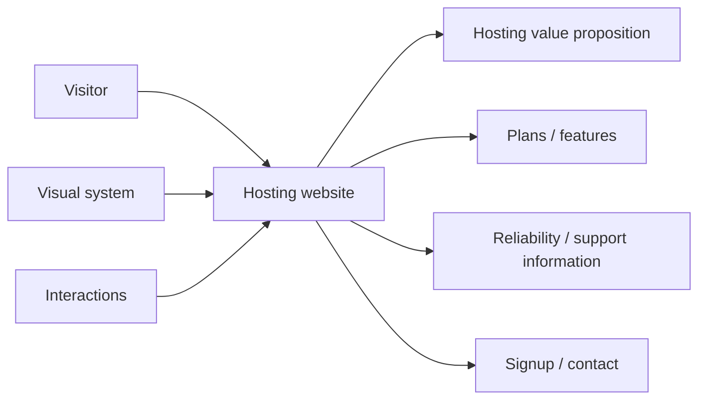
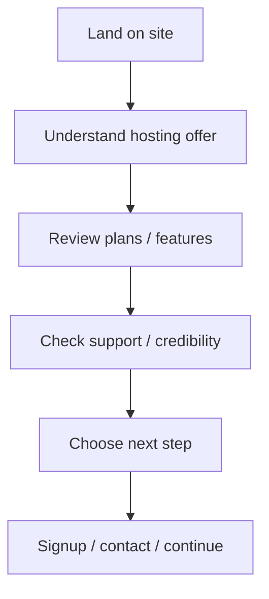
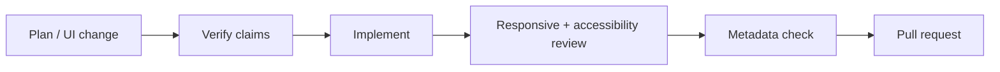

<div align="center">

# Grid Labs Hosting

**A hosting-services website project for communicating plans, infrastructure value, support, and clear conversion paths through a responsive web experience.**


[Browse source](https://github.com/Nischhalsubba/Grid-Labs-Hosting/tree/main) · [Issues](https://github.com/Nischhalsubba/Grid-Labs-Hosting/issues)

</div>

## Overview

**Grid Labs Hosting** is documented around a typical hosting-customer journey: understand the offer, compare relevant capabilities, build trust, and reach a purchase, signup, or contact path with minimal ambiguity.

<details open>
<summary><strong>🏗️ Interactive website architecture</strong></summary>



</details>

## Visitor flow



## Audience guide

| Audience | Focus |
|---|---|
| Customers | Plans, capabilities, trust and support |
| Developers | Page structure, interactions and delivery |
| Designers | Comparison clarity, responsive layout and conversion hierarchy |
| Content teams | Accurate plan details, claims, pricing and metadata |

## Getting started

```bash
git clone https://github.com/Nischhalsubba/Grid-Labs-Hosting.git
cd Grid-Labs-Hosting
```

Use the manifests and lockfiles in the repository to determine current setup commands.

## Design & trust

Hosting sites should make technical claims understandable without hiding important constraints. Keep plan comparisons readable, focus visible, contrast sufficient, calls to action distinct, and mobile layouts free of horizontal comparison-table disasters.

## SEO & discoverability

Use accurate terms such as **web hosting, hosting plans, website hosting, hosting services, server hosting, managed hosting, and hosting support** only when supported by the actual offering. Maintain unique titles/descriptions, semantic headings, structured organization/product data where appropriate, canonical URLs and social metadata.

## Contribution flow


