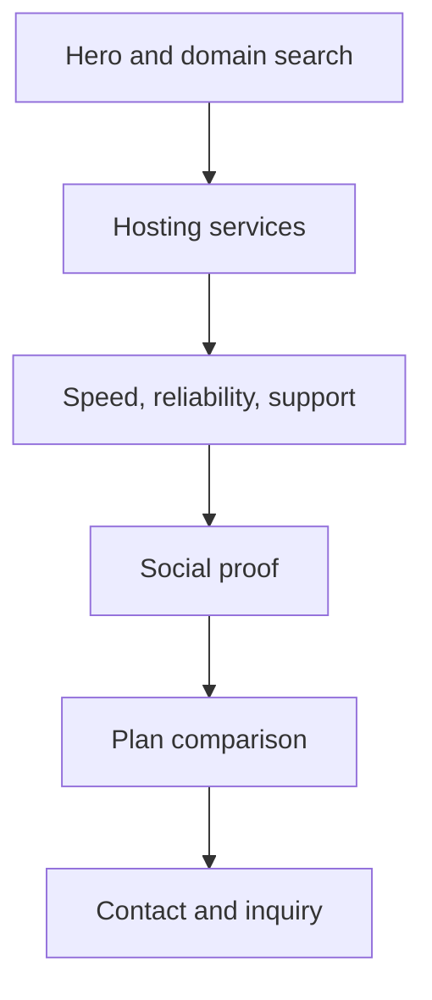
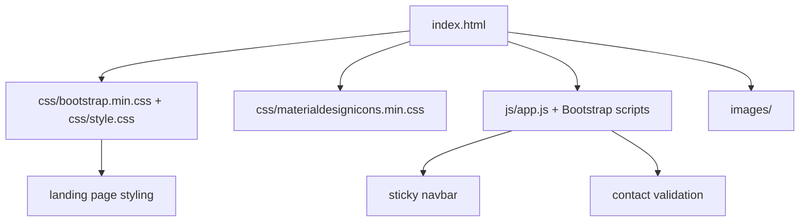

# Grid Labs Hosting — Product and Engineering Case Study

> A comprehensive product, UX, conversion, accessibility, content, static-site architecture, privacy, deployment, and maintenance case study for the `Grid-Labs-Hosting` repository. This document is intentionally detailed so future maintainers, designers, developers, reviewers, and AI coding agents can understand the site without mistaking a Bootstrap landing page with placeholder hosting copy for a production hosting business. The button says “Search Now,” but sadly, capitalism does not become real through an unconnected form.

## Table of Contents

1. [Executive Summary](#executive-summary)
2. [Repository Snapshot](#repository-snapshot)
3. [Product Context](#product-context)
4. [Current Reality Check](#current-reality-check)
5. [Problem Statement](#problem-statement)
6. [Target Audiences](#target-audiences)
7. [Core Product Promise](#core-product-promise)
8. [Landing Page Strategy](#landing-page-strategy)
9. [Information Architecture](#information-architecture)
10. [Section-by-Section Product Analysis](#section-by-section-product-analysis)
11. [Conversion Strategy](#conversion-strategy)
12. [Domain Search Experience](#domain-search-experience)
13. [Hosting Plans and Pricing Strategy](#hosting-plans-and-pricing-strategy)
14. [Testimonials and Trust Strategy](#testimonials-and-trust-strategy)
15. [Contact Form Strategy](#contact-form-strategy)
16. [Visual Design Direction](#visual-design-direction)
17. [Accessibility Strategy](#accessibility-strategy)
18. [Static-Site Architecture](#static-site-architecture)
19. [JavaScript Behavior](#javascript-behavior)
20. [Asset and Image Strategy](#asset-and-image-strategy)
21. [SEO and Structured Data Strategy](#seo-and-structured-data-strategy)
22. [Performance Strategy](#performance-strategy)
23. [Security and Privacy Notes](#security-and-privacy-notes)
24. [Deployment Strategy](#deployment-strategy)
25. [Testing and Quality Strategy](#testing-and-quality-strategy)
26. [Risk Register](#risk-register)
27. [Maintenance Playbook](#maintenance-playbook)
28. [Roadmap](#roadmap)
29. [Portfolio Review Notes](#portfolio-review-notes)
30. [AI Coding Agent Notes](#ai-coding-agent-notes)
31. [Appendix A: Suggested Hosting Content Contract](#appendix-a-suggested-hosting-content-contract)
32. [Appendix B: Manual QA Matrix](#appendix-b-manual-qa-matrix)
33. [Appendix C: Launch Readiness Checklist](#appendix-c-launch-readiness-checklist)
34. [Appendix D: Suggested AGENTS.md](#appendix-d-suggested-agentsmd)
35. [Appendix E: Glossary](#appendix-e-glossary)
36. [Disclaimer](#disclaimer)

---

## Executive Summary

**Grid Labs Hosting** is a static Bootstrap-based landing page for a hosting or technology services company. The project includes a single-page marketing flow with a fixed navigation bar, hero domain-search form, service cards, feature blocks, testimonial carousel, pricing tabs, and contact form UI.

The site is useful as a landing-page concept and portfolio artifact. It demonstrates common SaaS and hosting-page patterns:

- visible hero value proposition
- domain-search interaction placeholder
- service segmentation
- feature explanations
- testimonial carousel
- pricing comparison
- contact CTA
- Bootstrap responsive layout
- small custom JavaScript behavior

However, the current implementation should not be mistaken for a production hosting platform. Several important pieces are still static or placeholder-based:

- the domain search does not connect to a real domain availability API
- the contact form only validates fields and does not submit messages
- service descriptions contain placeholder copy
- testimonials appear to be placeholder content
- pricing values need business validation
- image alt text is often empty
- some links use empty `href` values
- privacy and terms pages are not present

The right way to document this repository is honestly: it is a strong static template foundation, not a finished hosting service. That distinction matters, because “unlimited hosting” written in a card is not infrastructure. It is just optimism in HTML.

---

## Repository Snapshot

| Attribute | Value |
|---|---|
| Repository | `Nischhalsubba/Grid-Labs-Hosting` |
| Visibility | Public |
| Default branch | `main` |
| Product type | Static hosting-company landing page |
| Framework/library | Bootstrap |
| Markup | HTML5 |
| Styling | CSS, Bootstrap, icon fonts |
| JavaScript | Plain JavaScript + Bootstrap behavior |
| Main page | `index.html` |
| Main custom script | `js/app.js` |
| Main custom style | `css/style.css` |
| Build step | None confirmed |
| Deployment model | Static hosting |
| Added guidance | `AGENTS.md` |

---

## Product Context

Hosting websites are usually conversion-focused. Visitors arrive with one of several intents:

- search for a domain
- compare hosting plans
- understand speed and reliability claims
- verify support availability
- check price tiers
- contact the team
- decide whether the provider looks credible

A hosting landing page therefore needs to balance trust, pricing clarity, service specificity, and low-friction contact.

Grid Labs Hosting follows a familiar structure for this category. That is not a weakness. Familiar patterns help users scan quickly. The risk is that familiar templates can become generic if copy, proof, and functionality stay placeholder-level.

The product opportunity is to move the page from “good static hosting template” to “credible hosting-company landing page.”

---

## Current Reality Check

### What exists

The current repository contains:

- a full `index.html` landing page
- Bootstrap navigation and responsive grid layout
- hero section with domain input and TLD select
- services section with hosting cards
- feature sections with illustrations and benefit copy
- testimonial carousel
- monthly/yearly pricing tabs
- contact section and validation hook
- custom sticky-navbar JavaScript
- image and icon assets

### What does not exist yet

The current repository does not include confirmed production integrations for:

- domain search
- checkout or plan selection
- contact form submission
- hosting account creation
- customer testimonial verification
- privacy policy
- terms of service
- analytics disclosure
- backend API

### Current product state

This is a static landing-page concept. It can be used for portfolio demonstration, but production use requires replacing placeholder content and connecting core conversion flows.

---

## Problem Statement

### User problem

A visitor interested in hosting needs to quickly understand what Grid Labs offers, what plans exist, why the service is trustworthy, and how to take the next step.

### Business problem

A hosting provider needs a landing page that converts visitors into domain searches, plan inquiries, signups, or contact submissions.

### Design problem

The page must make technical hosting services feel clear, trustworthy, and easy to compare.

### Engineering problem

The current page is static. It needs honest handling of non-functional UI elements, clear content replacement, and safe integration paths if real domain search or contact submission is added.

### Trust problem

Hosting claims such as “fast,” “reliable,” “24/7 support,” and “unlimited” require proof. If not validated, they should be softened or removed.

---

## Target Audiences

### 1. Small business owners

Need simple hosting, domain search, pricing, and confidence that support is available.

### 2. Startup founders

Need quick comparison of hosting plans and a path to launch a website.

### 3. WordPress site owners

Need clarity around WordPress hosting, storage, SSL, email, backups, and support.

### 4. Portfolio reviewers

Need to see a complete landing-page structure and understand design decisions.

### 5. Future maintainers

Need to know which parts are static UI and which parts must be connected before production.

---

## Core Product Promise

A production-ready Grid Labs Hosting page should promise:

1. **Clarity**
   - Services and pricing are easy to understand.

2. **Trust**
   - Technical claims are specific and supportable.

3. **Fast action**
   - Domain search, plan selection, or contact is obvious.

4. **Responsive access**
   - The page works on desktop and mobile.

5. **Honest functionality**
   - Buttons and forms do what they appear to do.

6. **Support confidence**
   - Contact and help options are visible.

7. **Static reliability**
   - The landing page deploys easily anywhere.

---

## Landing Page Strategy

The page follows a classic hosting-company conversion funnel:



### Why this works

Hosting buyers often need confidence before commitment. The structure begins with the primary action, explains available services, reinforces trust, shows pricing, and ends with contact.

### Main conversion problem

The first action, domain search, is currently a UI placeholder. If it remains unconnected, the page should make that clear or redirect users to contact instead.

---

## Information Architecture

### Navigation sections

| Nav item | Target | Purpose |
|---|---|---|
| Home | `#home` | value proposition and domain search |
| Services | `#services` | hosting categories |
| Features | `#features` | performance and support benefits |
| Testimonial | `#testimonial` | social proof |
| Pricing | `#pricing` | plan comparison |
| Contact | `#contact` | inquiry path |

### IA strengths

- single-page flow is easy to scan
- section anchors are simple
- pricing and contact are late enough to be informed actions
- Bootstrap layout supports responsive sections

### IA risks

- no dedicated FAQ section
- no terms/privacy pages
- no domain-search result page
- no plan detail page
- no checkout flow

---

## Section-by-Section Product Analysis

### Navigation

The navbar is fixed and section-based.

Strengths:

- simple anchor links
- mobile collapse support
- sticky behavior through JavaScript

Risks:

- logo alt text is empty
- brand link points to `index-1.html`, which may not exist or may be template residue
- no privacy/terms links

### Hero

The hero includes a hosting value proposition and domain search form.

Strengths:

- primary action is visible immediately
- TLD selector supports common extensions
- headline is category-appropriate

Risks:

- domain search does not appear connected
- form lacks a label/helper text
- placeholder copy remains
- no proof under the hero

### Services

Service cards include shared hosting, WordPress hosting, and unlimited hosting.

Strengths:

- easy scan pattern
- clear category segmentation

Risks:

- empty card links
- placeholder descriptions
- “Unlimited Hosting” requires careful terms

### Features

Feature blocks describe speed, reliability, support, and performance.

Strengths:

- good visual rhythm
- image/text alternation supports scanning

Risks:

- placeholder copy
- empty image alt text
- performance claims need proof

### Testimonials

Bootstrap carousel shows customer proof UI.

Strengths:

- familiar social proof pattern
- carousel controls include visually hidden labels

Risks:

- likely placeholder names/images
- no testimonial source or company proof
- fake testimonials would be a trust problem

### Pricing

Monthly/yearly tabs compare plans.

Strengths:

- pricing comparison is important for hosting
- monthly/yearly toggle is useful
- plan cards show included/excluded features

Risks:

- pricing must be validated
- repeated “Free Domain” exclusion appears redundant
- select buttons use empty links
- no terms for discounts/refunds

### Contact

The contact form validates required fields.

Strengths:

- final conversion section exists
- form validation prevents empty submissions

Risks:

- form does not submit anywhere
- validation messages are injected as HTML
- no privacy note for contact data
- no backend or form provider

---

## Conversion Strategy

A hosting landing page should define conversion clearly.

### Possible primary conversions

| Conversion | Current status | Requirement |
|---|---|---|
| domain search | UI only | connect to API or remove implication |
| select plan | empty links | connect to checkout/contact |
| contact form | validation only | connect to backend/form provider |
| call/email | depends on contact content | ensure real details |

### Recommended conversion hierarchy

1. Search domain
2. Compare plans
3. Contact support/sales
4. Select plan

### Rule

Never use a fake conversion control in production. A button that goes nowhere is not minimalism. It is betrayal with border-radius.

---

## Domain Search Experience

### Current behavior

The hero has:

- text input for domain name
- select dropdown for TLD
- submit button

But no confirmed search integration exists.

### Production options

1. Connect to a domain registrar API.
2. Redirect query to a domain registrar search URL.
3. Convert the form into an inquiry form.
4. Remove domain search if not supported.

### UX requirements

- validate domain input
- explain supported TLDs
- show loading state
- show availability result
- provide next action
- handle errors clearly

---

## Hosting Plans and Pricing Strategy

### Current plan UI

The page shows monthly/yearly pricing tabs and feature lists.

### Pricing content rules

- every feature must be accurate
- storage limits must match backend/package reality
- email account counts must be real
- SSL inclusion must be clear
- refund policies must be documented
- discounts must show terms

### Risky claims

- unlimited hosting
- 24/7 support
- 30-day money back
- free SSL
- free domain
- Google Ads

These claims may be valid, but they need operational backing.

---

## Testimonials and Trust Strategy

### Current testimonial risk

The current testimonials appear placeholder-based.

### Production-safe options

- replace with real testimonials with permission
- remove names/images if not real
- use anonymous aggregate statements only if accurate
- replace testimonials with infrastructure proof

### Better trust signals

- uptime status link
- support response expectations
- data center or CDN information
- SSL/security notes
- backup policy
- refund terms
- migration support

---

## Contact Form Strategy

### Current behavior

`js/app.js` validates required fields and returns `false`, preventing actual submission.

### Production options

- Formspree
- Netlify Forms
- Cloudflare Workers email endpoint
- backend API
- mailto fallback

### Privacy requirements

If collecting names, emails, subjects, and messages:

- explain what data is collected
- explain why it is collected
- include privacy policy
- avoid sending data to unknown services without disclosure

### Accessibility requirements

- label fields visibly or with accessible labels
- announce validation errors
- avoid only injecting visual alert messages
- maintain focus management after error

---

## Visual Design Direction

The page has a clean Bootstrap SaaS/hosting style.

### Visual strengths

- light background
- blue primary accent
- card-based services and pricing
- familiar hosting iconography
- responsive grid
- readable section rhythm

### Visual weaknesses to fix before launch

- placeholder content weakens trust
- empty image alt text
- generic stock testimonial avatars
- pricing cards need clearer hierarchy
- some CTA links are empty

### Design direction

Keep it clean, direct, and conversion-oriented. Hosting users do not need mysterious abstract hero poetry. They need to know if the site will stay online and how much the plan costs. Wild concept, apparently.

---

## Accessibility Strategy

### Current positives

- Bootstrap navbar uses accessible collapse attributes
- carousel controls include visually hidden text
- semantic sections exist
- text contrast appears reasonable in many areas

### Current concerns

- many meaningful images use empty alt text
- domain input has no explicit label
- select input has no explicit label
- form validation messages may not be announced
- empty links can confuse keyboard users
- carousel indicators include image/avatar content inside buttons

### Required improvements

- add meaningful alt text
- add form labels or `aria-label`
- replace empty links with real links or buttons
- ensure keyboard focus states are visible
- test carousel keyboard behavior
- add accessible validation messaging

---

## Static-Site Architecture

The repo is simple:



### Strength

No build step means deployment is easy.

### Weakness

No content abstraction means larger edits happen directly in HTML.

### Maintenance rule

For this project size, direct HTML editing is acceptable. If the site grows beyond one page, introduce templates or migrate to Astro/Vite.

---

## JavaScript Behavior

`js/app.js` provides:

- sticky navbar class toggle on scroll
- contact form validation
- fade-in validation message behavior

### Sticky navbar notes

The scroll listener calls `ev.preventDefault()` on scroll. This is unnecessary and should be removed because scroll events are not cancelable in the useful way this code implies.

### Contact validation notes

The validation function checks:

- name
- email
- subject
- comments

It then returns false even when fields are filled. This confirms the form is validation-only and not submission-ready.

### JavaScript risks

- `window.onload(typewrite());` calls `typewrite()` immediately and assumes the function exists. If `typewrite` is undefined, this can create runtime errors.
- validation messages are injected through `innerHTML`
- no email-format validation exists
- no backend submit logic exists

---

## Asset and Image Strategy

The page uses:

- logo image
- favicon
- feature illustrations
- testimonial avatars
- icon fonts

### Asset rules

- compress images
- use WebP where practical
- add meaningful alt text
- remove unused images
- ensure logo has useful alt text
- replace stock avatars if testimonials are not real

### Risk

Stock or placeholder visuals can make a hosting company look less credible if the copy claims real customers.

---

## SEO and Structured Data Strategy

### Current state

The page has a title but lacks robust SEO metadata in the inspected head section.

### Required SEO tags

- meta description
- canonical URL
- Open Graph title
- Open Graph description
- Open Graph image
- Twitter card
- Organization schema
- Service schema if services are real

### Suggested title pattern

```html
<title>Grid Labs Hosting — Web Hosting, Domain Search, and Website Support</title>
```

### Structured data caution

Only add product/service structured data for real services and prices. Search engines do not enjoy fiction. Neither do customers, once invoices appear.

---

## Performance Strategy

### Strengths

- static files
- Bootstrap is local
- no heavy framework runtime
- simple JavaScript

### Performance risks

- unoptimized images
- unused Bootstrap/icon CSS
- large stock illustrations
- carousel assets
- no lazy loading

### Recommendations

- add `loading="lazy"` for below-fold images
- compress hero and feature images
- remove unused CSS if needed
- add width/height attributes to images
- test Lighthouse before deployment

---

## Security and Privacy Notes

### Contact form

If the contact form is connected later, it collects personal data. A privacy note should explain what happens to submissions.

### Domain search

If connected to a third-party domain search provider, disclose provider behavior where relevant.

### Testimonials

Do not publish fake testimonials. Besides being ethically bad, it is also embarrassingly detectable when every fake person sounds like a template had a LinkedIn account.

### Tracking

Do not add analytics or marketing pixels without a privacy notice.

---

## Deployment Strategy

Because this is static HTML/CSS/JS, it can deploy to:

- GitHub Pages
- Netlify
- Vercel
- Cloudflare Pages
- cPanel/static hosting

### Deployment steps

1. Replace placeholder content.
2. Verify links.
3. Verify form behavior.
4. Add SEO metadata.
5. Test mobile.
6. Deploy repository root or static folder.
7. Test live URL.
8. Test social preview.

---

## Testing and Quality Strategy

### Local test command

```bash
python -m http.server 8000
```

Open:

```text
http://127.0.0.1:8000/
```

### Manual QA requirements

- navbar links scroll correctly
- mobile menu opens/closes
- carousel works
- pricing tabs switch correctly
- contact validation works
- empty links are removed or fixed
- images load
- mobile layout is readable
- placeholder text removed
- form expectations are honest

---

## Risk Register

| Risk | Severity | Why it matters | Mitigation |
|---|---:|---|---|
| fake domain search | High | user trust break | connect API or remove action |
| contact form does not submit | High | lost leads | connect provider or explain state |
| placeholder testimonials | High | credibility and ethics risk | use real testimonials or remove |
| unlimited hosting claim | High | legal/support risk | clarify terms |
| empty links | Medium | broken UX | replace with real targets |
| empty image alt text | Medium | accessibility issue | add meaningful alt text |
| no privacy policy | Medium | form/tracking risk | add privacy page before data collection |
| no SEO metadata | Medium | weak sharing/search | add meta and OG tags |
| unoptimized images | Medium | slow page | compress/lazy-load images |
| direct HTML maintenance | Low/Medium | harder scaling | migrate if multi-page grows |

---

## Maintenance Playbook

### Replace placeholder copy

1. Search for `Lorem ipsum`.
2. Replace each section with real service-specific content.
3. Confirm claims are true.
4. Recheck layout after text length changes.

### Fix domain search

1. Decide API, redirect, or remove.
2. Add validation.
3. Add loading state.
4. Show success/error result.
5. Document provider behavior.

### Fix contact form

1. Choose backend/form provider.
2. Add submit endpoint.
3. Add spam protection if needed.
4. Add success and error states.
5. Add privacy copy.

### Update pricing

1. Confirm real plans.
2. Confirm monthly/yearly discount.
3. Remove unsupported features.
4. Add terms for refund/free domain/Google Ads if claimed.
5. Test tab behavior.

### Improve accessibility

1. Add labels.
2. Add alt text.
3. Fix empty links.
4. Test keyboard navigation.
5. Test mobile menu.

---

## Roadmap

### Near term

- Replace Lorem Ipsum copy.
- Add meaningful image alt text.
- Fix empty links.
- Clarify domain search behavior.
- Clarify contact form behavior.
- Add SEO metadata.
- Add privacy and terms links.

### Mid term

- Connect contact form.
- Connect domain search or remove it.
- Replace fake testimonials.
- Add FAQ section.
- Add hosting comparison table.
- Optimize images.
- Add structured data.

### Long term

- Add plan detail pages.
- Add checkout/signup flow.
- Add support knowledge base.
- Add uptime/status page.
- Add customer dashboard only if backend exists.
- Migrate to Astro or another static framework if content grows.

---

## Portfolio Review Notes

This repository is a good portfolio artifact for static landing-page design and Bootstrap implementation if presented honestly.

### Strong portfolio angle

- marketing landing page structure
- hosting SaaS IA
- responsive Bootstrap layout
- pricing and testimonial sections
- conversion-focused landing page pattern
- static deployment simplicity

### Strong honest summary

> Built a static Bootstrap landing page concept for a hosting and technology services company, including hero domain-search UI, service cards, feature sections, testimonial carousel, pricing tabs, and contact-form validation. Documented production gaps around placeholder copy, real domain search, contact submission, testimonials, pricing claims, accessibility, SEO, and privacy readiness.

### What not to claim

Do not claim:

- the domain search is functional unless connected
- the contact form sends messages unless connected
- testimonials are real unless verified
- hosting plans are production offers unless validated
- unlimited hosting exists without terms

---

## AI Coding Agent Notes

Future AI agents should treat this as a static Bootstrap landing page with production-readiness gaps.

### Inspect first

1. `README.md`
2. `AGENTS.md`
3. `index.html`
4. `js/app.js`
5. `css/style.css`
6. `images/`

### Do not

- Do not add fake testimonials.
- Do not imply forms submit if they only validate.
- Do not create fake domain availability results.
- Do not leave empty `href` values in production.
- Do not collect user data without privacy notice.
- Do not claim “unlimited” without terms.

### Prefer

- static-safe changes
- truthful copy
- accessible forms
- meaningful alt text
- real CTAs
- content cleanup before visual polish

---

## Appendix A: Suggested Hosting Content Contract

```ts
type HostingPlan = {
  name: string;
  billingPeriod: 'monthly' | 'yearly';
  price: number;
  currency: 'USD' | 'NPR' | string;
  description: string;
  features: Array<{
    label: string;
    included: boolean;
    note?: string;
  }>;
  termsUrl?: string;
};
```

```ts
type HostingService = {
  title: string;
  summary: string;
  bestFor: string[];
  ctaLabel: string;
  ctaUrl: string;
};
```

---

## Appendix B: Manual QA Matrix

| Area | Test | Expected result |
|---|---|---|
| local server | `python -m http.server 8000` | site loads locally |
| nav | click section links | scrolls to correct sections |
| mobile nav | toggle menu | opens/closes correctly |
| hero | domain form | either works or clearly does not imply live search |
| services | card links | no empty links in production |
| features | images | images load and alt text is meaningful |
| carousel | testimonial controls | keyboard and buttons work |
| pricing | monthly/yearly tabs | active tab changes content |
| contact | empty submit | validation message appears |
| contact | filled submit | production behavior is clear |
| accessibility | keyboard tab | logical focus order |
| SEO | head tags | title, description, OG tags present |
| performance | image size | no unnecessarily large assets |

---

## Appendix C: Launch Readiness Checklist

- [ ] all Lorem Ipsum removed
- [ ] all empty links fixed
- [ ] all meaningful images have alt text
- [ ] logo alt text added
- [ ] domain search connected or repositioned as inquiry
- [ ] contact form connected or clearly non-submitting
- [ ] privacy page added if data is collected
- [ ] terms page added if pricing/services are real
- [ ] testimonials verified or removed
- [ ] unlimited claims reviewed
- [ ] pricing values validated
- [ ] SEO metadata added
- [ ] Open Graph image added
- [ ] mobile layout tested
- [ ] carousel tested
- [ ] pricing tabs tested
- [ ] live deployment tested

---

## Appendix D: Suggested AGENTS.md

```md
# Repository Instructions

## Setup

This is a static Bootstrap-based hosting landing page. There is no confirmed package manager or build step. Open `index.html` directly or serve it with a static server.

## Commands

`python -m http.server 8000`

## Coding conventions

- Edit `index.html` for page sections and content.
- Keep Bootstrap layout classes consistent.
- Use meaningful alt text for meaningful images.
- Replace placeholder testimonials, pricing, hosting claims, and contact details before production use.
- Do not imply domain search or contact form functionality unless connected.

## Testing

Manually test navbar links, mobile menu, pricing tabs, testimonial carousel, contact validation, images, mobile layout, and placeholder content removal.

## Do not

- Do not add fake testimonials.
- Do not claim unlimited hosting without terms.
- Do not publish placeholder pricing as real pricing.
- Do not collect form data without a backend and privacy notice.
```

---

## Appendix E: Glossary

| Term | Meaning |
|---|---|
| Bootstrap | CSS/JS framework used for layout and components |
| Domain search | UI pattern for checking domain availability |
| TLD | top-level domain, such as `.com` or `.net` |
| Static site | website served as HTML/CSS/JS without backend rendering |
| Carousel | rotating testimonial/content component |
| Pricing tabs | monthly/yearly plan switcher |
| Conversion | desired visitor action such as search, signup, or contact |
| Placeholder copy | temporary content that must be replaced before launch |
| CTA | call to action |

---

## Disclaimer

Grid Labs Hosting is currently a static landing-page concept. It should not be treated as a production hosting service until real service descriptions, pricing, domain search behavior, contact submission, testimonials, privacy policy, terms, accessibility fixes, and deployment verification are complete.
